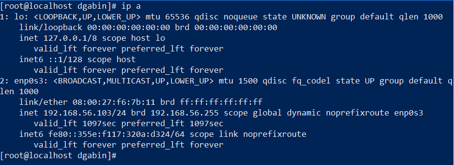
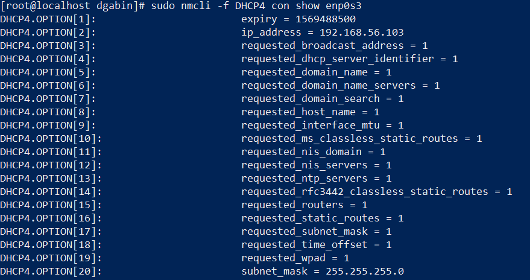
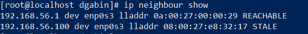

# TP1-Back-to-basics-Reseau

I. Gather informations

* Liste des cartes réseau

 

* IP en DHCP 

 

* Table ARP adresses MAC 

* Table de routage 

 

* Liste des ports en écoute 

 

* Requete DNS 

* Etat du firewall 

 

II. Edit configuration

